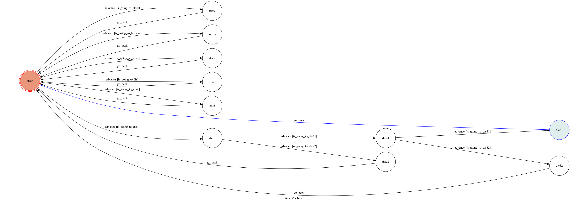

# README

## 說明
讓你能快速搜尋有關於資金之資訊

## 使用方式
照著括號內之文字輸入，或回答問題，即會回答資訊
###  步驟
 輸入代碼-->利用爬蟲輸出銀行代碼
 輸入定存-->輸出定存利率計算之網站
 輸入信貸-->輸出銀行信貸之利息計算之網站
 輸入股市-->輸出當日股市之網站
 輸入詐騙-->輸出兩張反詐騙圖片
 輸入自殺-->輸出真的假的-->if 輸入真的-->輸出男的女的-->if輸入男的-->輸出圖片及文字
 輸入自殺-->輸出真的假的-->if 輸入真的-->輸出男的女的-->if輸入女的-->輸出圖片及文字
 輸入自殺-->輸出真的假的-->if 輸入假的-->輸出髒話

